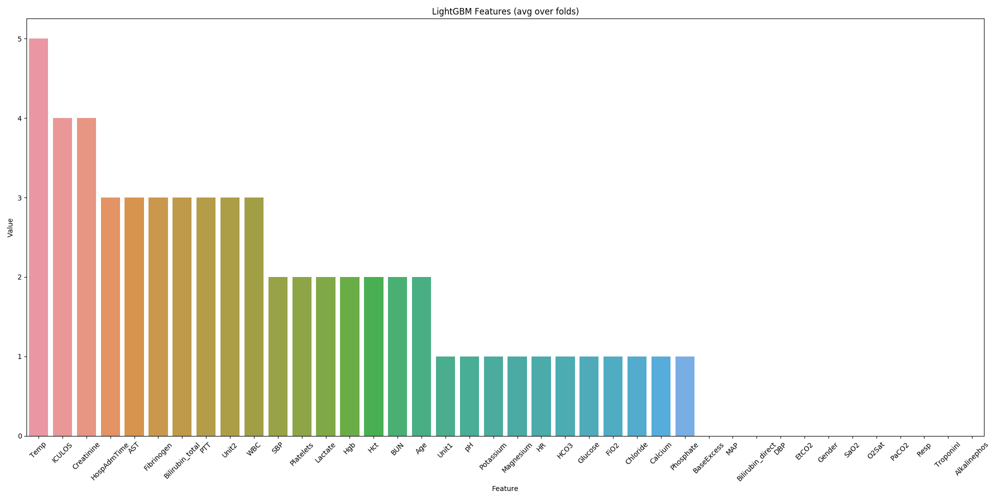

# Early sepsis prediction using binary classification 

#### Intro
This work is for ADIN (Data analsis and business intelligence) subject.

#### Solution
LightGBM classifier was used here.
All the models can be ensembled and tested with the same splits.
---

LightGBM is fed with raw data with no future extraction. 

LightGBM saves 5 models that should be used in ensembling, as an average prediction. It also performs 
the threshold search for the best threshold and save features importance.

---

All the runs perform extensive logging that should faciliate the process of preparing the solutions.


## Results

LightGBM scores 0.40072137437968547 in Stratified 5 fold local CV, without tuning. It can be even better in the real 
test because of ensembling. 

Classifier works on almost raw data!


## Installation
``pip install -r requirements.txt``

Download the data, directory _training_ into 

_data/raw/_

## Running

1. Convert data to .csv
    ```python psv_to_csv.py```
    
    it create _data/processed/training_ directory with .csv files

2. Convert data to pickle and hdf, with different NaN filling
    ```python data_segregation.py```

3. training
    ```python training.py```
    
    Training as is will train lightgbm models and will save logs in _data/logs_
    
4. Classfier(this should not be run, its a supporting file)
    ```python classifier.py```
    
    Classifer is our LGBM classfier as per the solution we want to obtain. it is used in training script for taining the model
    
5.Score_all
   ```python score_all.py``` 
   
   This file takes a input directory(training files) and reads all files and gives score for each prediction and label it in every file.(input and output directories needs to be given as arguments).

6.Compute_scores
    ```python compute_scores.py```
    This file is used to find out some statistics about the model and predictions. it takes input as directories of output files from above script and gives out AUROC,AUPRC,ACCURACY,f-MEASURE,UTILITY SCORE

## Sampleoutput (imporatnce of features)




